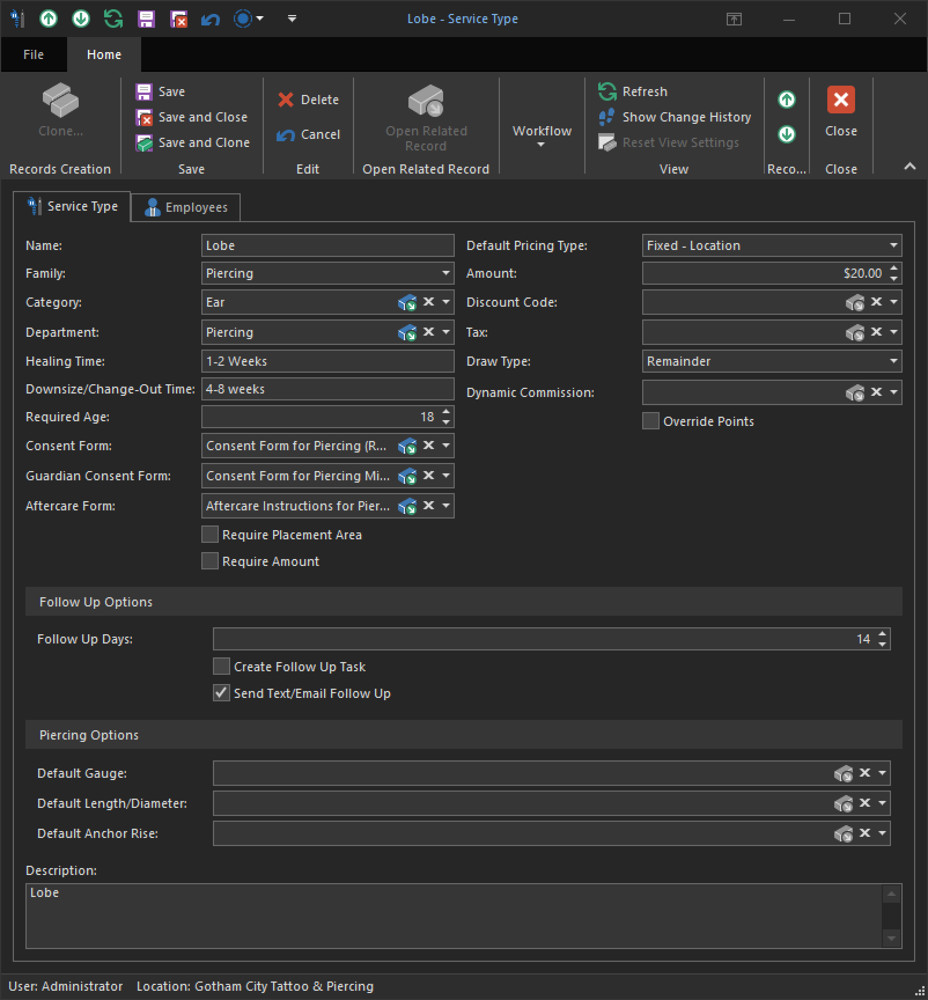

# Quick Start: Set service prices

By default, REV23 Desktop comes configured with the most common service types already added, which includes a large selection of piercing types. There are several ways to price services. You can use a custom amount (that you type in) for each service, or it can be set by the studio or the employee performing it. Additionally, you can calculate the price based on size or more popularly, an hourly rate. In the case of Gotham City Tattoo & Piercing, they need to set the prices for their piercing service types since that is the most common scenario.

1. Navigate to **Configuration > Service Types** to open the Service Types List View. 

2. Much like the Inventory Item List View you saw when we added a sellable item, the Service Types List View also has a category tree on the left hand side. Expanding the tree allows you to dig into each of the subcategories. Let's expand the **Piercing** category by clicking the arrow to the left of the category, then expand the **Ear** subcategory. This will show us all of the service types in the Ear category on the right.

    
   
3. Double click the **Lobe** record to open the Service Detail View for the Ear Lobe Service Type. 

    

Here is where we configure how each service type behaves in REV23 Desktop, from how it is priced, to changing which template we use for aftercare and release forms. 

4. By default for piercings, the **Default Pricing Type** is set to *Fixed - Location*. This means the price of this service type is always the same and determined by the studio. We will type $20.00 in to the **Amount** editor. Everything else we will leave as defaults for now. 

5. Click the **Save & Close** action to save this change to the database.

We're now ready to start piercing some ear lobes! Repeat this process for each of your piercing types. You can also take this time to adjust some other settings, such as tax (if applicable), the default healing times, change-out times or required age, which is the age someone is able to have this service type performed without a guardian.